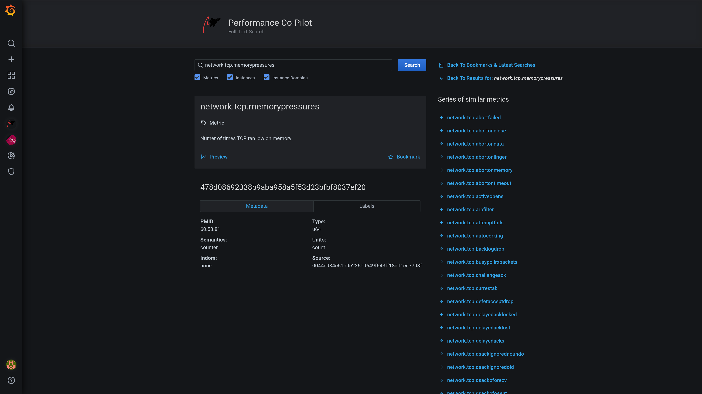
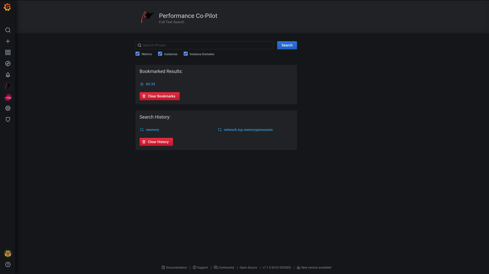

# Extending Grafana Integration of Performance Co-Pilot - Project Summary

## Improving Metric Search

Since [performancecopilot/grafana-pcp](https://github.com/performancecopilot/grafana-pcp) rewrite was still in progress during early June 2020 to late July 2020, separate repository was created in which I have worked on App plugin part of what would once be merged with [grafana-pcp](https://github.com/performancecopilot/grafana-pcp). This [grafana-pcp-app](https://github.com/Erbenos/grafana-pcp-app/) contains all work done up to until rewrite was finished, after which code was merged with [grafana-pcp](https://github.com/performancecopilot/grafana-pcp) and further work continued in its fork. It also includes [CHANGELOG.md](https://github.com/Erbenos/grafana-pcp-app/blob/master/CHANGELOG.md), which documents what was being worked on to that occasion.

Most of the backend PCP related functionality to querying / filling underlying Redisearch powered Redis datastore was done ahead of me, with me having to further play around with what was already provided to arrive at satisfactory state to query against from the Grafana frontend. This included creating new endpoints, modifying Redisearch schema to better fit frontend needs, writing tests and man pages, as well as troubleshooting and providing workarounds for [OSS version of Redisearch module](https://github.com/goodform/RediSearch)'s quirks and issues, that were mostly addressed in latest upstream [Redisearch](https://github.com/RediSearch/RediSearch) version, including weird tokenizing behavior, incorrect handling of stop words, e.g. with fuzzy search, and unconsistent query parsing. Despite all roadblocks, working with Redisearch was a great learning opportunity and my introduction to the field of fulltext search engines.

Final Redisearch schema is as follows:

```
 FT.CREATE pcp:text SCHEMA
		TYPE TAG SORTABLE
		NAME TEXT WEIGHT 9 SORTABLE
		INDOM TAG
		ONELINE TEXT WEIGHT 4
		HELPTEXT TEXT WEIGHT 2
```

Compared to schema mentioned in project's proposal, _TYPE_ and _INDOM_ fields have changed its types - since exact match functionality was needed and **TAG**, unlike **TEXT**, supports it.

Around this schema, following endpoints are build:

- **/search/text**<br>Performs a text search query across metrics and instance domains - all forms of names and help texts.
- **/search/suggest**<br>Provides search query suggestions, that is, metric and instance names.
- **/search/indom**<br>Provides all entities (instances, metrics) related to indom, includ‐
  ing itself, that is passed to the server via the query parameter.
- **/search/info**<br>Provides metrics relating to operation of the search engine, in par‐ticular showing document and text record counts.

Above endpoints, together with some of **/series/\*** ones described at [pmwebapi(3)](https://pcp.io/man/man3/pmwebapi.3.html), provide all data needed.

Frontend full-text search functionality is a simple React SPA wrapped by Grafana's App plugin. These types of plugins are already being mentioned as 'Legacy' in Grafana's [documentation](https://grafana.com/docs/grafana/latest/developers/plugins/legacy/apps/) (another change made since proposal submission), but migrating full-text search to be contained by Panel plugin, if App plugins get deprecated, should be straightforward. Plugin offers capability of searching of data indexed by Redisearch with suggestions, while keepeing search history, browsing offered listings, bookmarking specific results and possibly previewing metrics. Typescript and React + Redux is used, majority of React components have tests written in Jest. Most of the UI uses components provided by [@grafana/ui](https://www.npmjs.com/package/@grafana/ui), with small stlying additions or custom components here and there, making sure both Light and Dark Grafana themes are supported by the UI.

This has been my first non-trivial experience with React and its ecosystem, for which I am very glad. First time I laid my hands on Jest (with Enzyme) as well.

### Related Pull Requests:

<details open>
  <summary><strong>performancecopilot/grafana-pcp</strong></summary>

- **work-in-progress fulltext part of plugin, jsonnet building/vendoring updated**<br>[performancecopilot/grafana-pcp PR#58](https://github.com/performancecopilot/grafana-pcp/pull/58)
- **fulltext: instance/instance domain related functionality**<br>[performancecopilot/grafana-pcp PR#60](https://github.com/performancecopilot/grafana-pcp/pull/60)
- **fulltext: minor typing/query tweaks**<br>[performancecopilot/grafana-pcp PR#61](https://github.com/performancecopilot/grafana-pcp/pull/61)
</details>

<details open>
  <summary><strong>performancecopilot/pcp</strong></summary>

- **man: additions/boilerplates for pmsearch related documentation**<br>[performancecopilot/pcp PR#966](https://github.com/performancecopilot/pcp/pull/966)
- **pmwebapi: redisearch related modifications to pmproxy, libpcp_web, pmsearch and man pages**<br>[performancecopilot/pcp PR#986](https://github.com/performancecopilot/pcp/pull/986)
- **pmproxy: /search/_ endpoints tweaks; man: pmwebapi.3; qa: simple pmproxy /search/_ test**<br>[performancecopilot/pcp PR#993](https://github.com/performancecopilot/pcp/pull/993)
- **pmproxy, pmsearch, libpcp_web: search functions renamed to be more alike to its series counterparts; man: updated docs of search related functions**<br>[performancecopilot/pcp PR#998](https://github.com/performancecopilot/pcp/pull/998)
- **libpcp_web: search edge case fix**<br>[performancecopilot/pcp PR#1007](https://github.com/performancecopilot/pcp/pull/1007)

</details>







## Support for Derived Metrics

Thanks to grafana-pcp rewrite earlier in summer 2020, adding derived metrics functionality was a breeze and was a smallest addition in GSoC project. There were some backend related hiccups that are mentioned in the PR below, which were resolved.

### Related Pull Requests:

<details open>
  <summary><strong>performancecopilot/grafana-pcp</strong></summary>

- **vector datasource: derived metrics + related qa**<br>[performancecopilot/grafana-pcp PR#62](https://github.com/performancecopilot/grafana-pcp/pull/62)
- **pmapi: handle semantic and syntax error when attempting to register derived metric**<br>[performancecopilot/grafana-pcp PR#65](https://github.com/performancecopilot/grafana-pcp/pull/65)
</details>

## Reactive Dashboard

Since the ['Reactive Dashboard' functionality was deprecated in late April 2020](https://github.com/grafana/grafana/issues/24059), just few weeks after my proposal was submitted, alternative solution had to be found. Since main aim of this subgoal was making it easier for end-users to orientate in data that Performance Co-Pilot offers within Grafana environment, without prior knowledge of metrics specific for domain of interest, and what their values mean, with help of my mentor, we have arrived at the conclusion that having prebuild dashboards that will be interlinkable and will include the tracking/alerting logic related to currently measured metric values, with further information available. Rest was pretty straightforward.

Two new panels were created for use in these dashboards:

#### NotifyGraphPanel

Instead of extending built-in Graph panel, which it aims to substitute, I use Graph component provided by [@grafana/ui](https://www.npmjs.com/package/@grafana/ui). This component is not as feature complete as Grafana's built-in one (based on Angular), but it uses React. Since entire Grafana frontend is in process of migrating to React, this makes it more forwards compatible, as in not breaking due to future changes. It supports showing modal, that shows user further information about metrics being displayed, additionally, it contains some logic which checks whether or not metric values are within some specified threshold, if not, additional UI for modal with information about metrics currently being processed, possible issues help, some further reading related to underlying data and links to related dashboards.

#### BreadcrumbsPanel

Used for navigation within tree of interlinked dashboards, providing links to all parents up to root (and all their siblings), shows currently viewed node ands links to children nodes, if any. Thanks to [Jsonnet](https://jsonnet.org/), providing data to these is as simple as calling a function on given tree node, minimalizing repetition.

Both <strong>NotifyGraphPanel</strong> and <strong>BreadcrumbsPanel</strong> are not intended for use in user-defined dashboards - there is no UI for populating threshold and metadata they use. There is no nice way to pluck them from 'Visualization' picker in Grafana, therefore they just show a warning when attempted to be used in such a way.

Dashboards are inspired by [performancecopilot/pcp-webapp-grafana checklist.json](https://github.com/performancecopilot/pcp-webapp-grafana/blob/checklist/checklist.json), with slightly different structure and contents. Since the dashboards are described using [Jsonnet](https://jsonent.org) as well, maintenance got easier at the slight cost in abstraction department. There is a single source-of-truth file for the checklist tree, which all dashboards depend on, with some utility functions that make it easier to work with. If tree structure changes, most of the heavy lifting related to checklist data in dashboards will be taken care of by simply regenerating `*.json` files.

Jsonnet has been a pleasure to use, therefore I am looking forward to using it for anything config heavy, should there be a need for it.

### Related Pull Requests:

<details open>
  <summary><strong>performancecopilot/grafana-pcp</strong></summary>

- **overview: provides interlinked checklist dashboards**<br>[performancecopilot/grafana-pcp PR#64](https://github.com/performancecopilot/grafana-pcp/pull/64)

</details>


